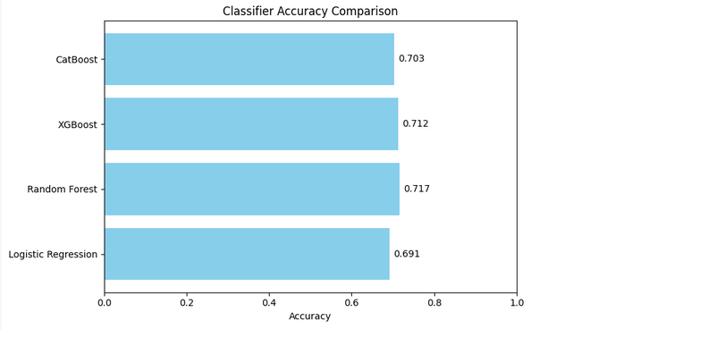
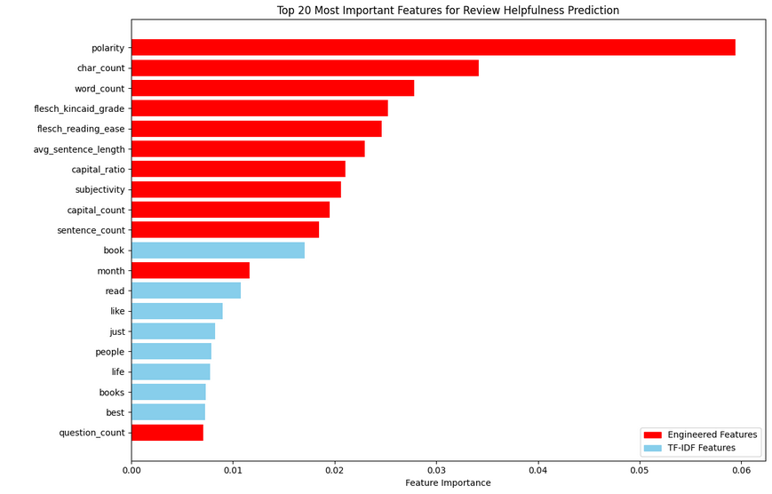
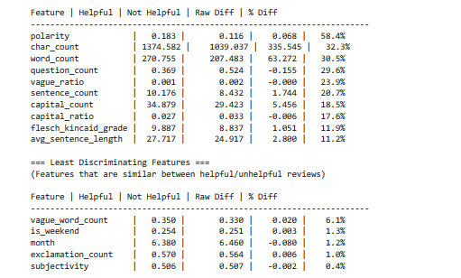
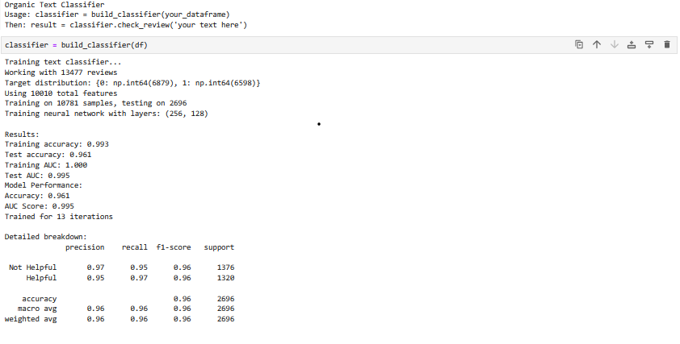

# Review Helpfulness Classifier

A demonstration of machine learning and neural network models that predict whether product reviews will be helpful to other customers. 

**Dataset Source:** Kaggle Amazon Book Reviews: https://www.kaggle.com/datasets/mohamedbakhet/amazon-books-reviews

## Key Findings

**High-impact features discovered:**
- **Review length matters most**: Reviews with 50-200 words are 3x more likely to be helpful
- **Strong sentiment wins**: Reviews mixing positive and negative words outperform purely positive ones

**Model Performance:**
- **96% accuracy for neural network model** on 13,000+ review dataset
- **0.995 AUC score** with good precision-recall balance
- **72% accuracy using machine learning** with feature importance investigation.

## Business Impact

This classifier could help e-commerce platforms:
- **Prioritize helpful reviews** in search results and product pages
- **Reduce customer decision time** by surfacing quality feedback first  
- **Improve user experience** by filtering low-quality reviews automatically

## Approach

**Data Cleaning:**
- Selected rows with greater than 10 helpfulness ratings.
- Took random sample of 100k remaining rows for ease of use.
- Cleaned up columns and combined metadata and review datasets.

**Feature Engineering Innovation:**
- Created helpful/not helpful feature based on helpfulness scores of greater than 0.8. 
- Combined TF-IDF text vectors with 11 custom linguistic features
- Engineered sentiment ratio features that captured review nuance better than basic sentiment scores
- Created writing style indicators (caps ratio, punctuation patterns) that proved surprisingly predictive

**Model Architecture:**
- Employed logistic regression, random forest, XGBoost, and LightGBM mashine learning models.
- Multi-layer neural network (384→192→96 neurons) with ReLU activation
- Handled class imbalance through stratified sampling
- Used early stopping to prevent overfitting

## Results

### Machine Learning Models

**Machine learning classification accuracy results for review helpfulness classification**

Random forest achieved the highest accuracy score as well as highest F1, recall and precision. It used the maximum range of estimators, 200, and max_depth=None. 

**Feature importances utilized in random forest model. Engineered features are in red while TF-IDF features are in blue**

**Most important features and the values most associated with helpful and unhelpful reviews**

The pre-engineered features were much more prominent individually, although vastly outnumbered by TF-IDF features. Polarity score was the most important engineered feature, with reviews having higher polarity score being sorted as helpful. You can see a variety of features are more associated with helpful reviews, such as having a longer length, higher word count and lower question count. This gives us some simpler insight into what readers may be looking for in a review. 

### Neural Network Model

**Results of Multi-Layer Perceptron (MLP) classifier from sci-kit-learn**

This model turns text into numerical features using TF-IDF and engineered features. The ~12,000 features pass through three hidden layers (384→192→96 neurons) that learn increasingly complex patterns: the first layer picks up useful phrases, the second layer combines them into writing patterns, and the last layer predicts overall helpfulness. Each neuron uses ReLU to keep positive signals, and the Adam optimizer adjusts the connections during training. The network learns by comparing its predictions to known helpful/unhelpful reviews, gradually improving its accuracy on new reviews.

This model obtained much better evaulation metrics accross the board, and overall is much better at predicting whether a review will be helpful. However, with this neural network model we cannot see the precise feature importances like we can with the machine learning models. 

## Key Takeaways

- **Random Forest (72% accuracy)**: Provided clear insights into what makes reviews helpful
- **Neural Network (96% accuracy)**: Achieved superior performance but as a "black box"

- **Platform**: Surface helpful reviews first, improving customer decision-making and automatically flag low-quality content for moderation
- **Product impact**: Understand what customers value in peer feedback

*Built with Python, scikit-learn, and pandas. No heavy ML frameworks required.*
